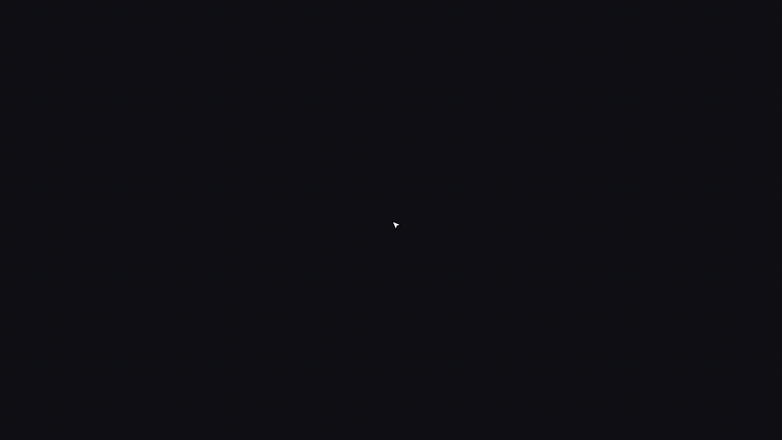

# remotion-cinematic

A Remotion template for building cinematic product demo videos. Prop-driven choreography, visual editor, geometry-aware cursor, scene-relative camera — all wired up and ready to customize.

Clone it, drop in your product screenshots, and use Claude to build your video.



## What you get

- **Prop-driven choreography** — window positions, sizes, entrances, and animations are Studio-editable props, not hardcoded values
- **Visual editor** — drag-to-move, drag-to-resize, snap guides, floating property panels, inline text editing — all inside Remotion Studio
- **Self-wiring editing** — Window titles, headlines, and CTA text are inline-editable in Studio automatically. New scenes get editing for free
- **Geometry-aware cursor** — targets real elements by ID, arc/linear/ease curve interpolation, click/drag/resize with smart shape switching
- **Visual cursor path editor** — SVG preview of cursor paths, curve selector, scale/rotation sliders, debounced live editing in Studio
- **Scene-relative camera** — keyframes reference scene names, not absolute frame numbers
- **Audio manager** — music bed with auto-fade, SFX cues with volume ducking
- **Push transitions** — continuous scene-to-scene slides, no fades or cuts
- **Per-scene zoom** — AutoZoom targets elements by ID for smooth, subtle focus shifts
- **UI state system** — frame-based interaction layer drives panel expand/collapse, button presses, message reveals
- **App UI from JSON** — render full app interfaces from a JSON descriptor (sidebar, topbar, tables, stats, chat)
- **Dynamic windows** — add windows via Element Palette at any frame, rendered across all scenes automatically
- **Figma CLI import** — `cinematic-import` CLI converts Figma frames or screenshots into app descriptors
- **5 example scenes** — chaos desktop, product reveal, feature showcase, headline, end card
- **509 tests** — engine, primitives, editor, CLI, schema, and end-to-end wiring
- **Claude skill** — `.claude/CLAUDE.md` teaches Claude how to build scenes with this template

## Quickstart

```bash
npx degit codeverbojan/remotion-cinematic my-video
cd my-video
npm install
npm run studio
```

Open `http://localhost:3000` and scrub through the demo video.

## Customize

### Studio props (no code required)

Open Remotion Studio and edit directly in the right panel:

- **Brand** — name, 10 color fields, fonts, logo URL
- **Headlines** — pain, resolution, closer text + font sizes + color
- **CTA** — call-to-action button text
- **Product features** — title + description array
- **Scenes** — enable/disable, duration, enter/exit directions, backgrounds
- **Window layout** — position, size, entrance style, animation timing, z-index for every window
- **Cursor path** — waypoint-based cursor choreography with per-segment curve type
- **Cursor style** — global cursor scale and rotation
- **App descriptor** — full JSON-driven app UI (sidebar items, topbar, content panels)
- **Music** — enabled, volume, fade in/out
- **Easing** — cinematic, snappy, smooth, elastic, bounce, spring

### Visual editor (in Studio)

Click any window to select it. Drag to reposition, use handles to resize. Snap guides appear when aligned with other windows or canvas center. Double-click text (headlines, window titles, CTA) to edit inline with a formatting toolbar.

The editor is frame-aware: when scrubbed past a window's animation start, edits target the end position instead of the start.

**Cursor path editor:** Visual SVG overlay showing cursor movement paths. Select waypoints to edit target, anchor, timing, and curve type (arc, linear, ease). Scale and rotation sliders adjust the cursor appearance.

**Element palette:** Click "+ Elements" to add windows from templates (window, small card, full width, left/right panel). Windows appear at the current frame position and render across all scenes.

### Code customization

1. **Brand colors + fonts** — edit `src/tokens.ts`
2. **Scene content** — edit `src/content.ts` (demo data, SFX config)
3. **Add scenes** — create files in `src/scenes/`, wire in `CinematicDemo.tsx`
4. **Product screenshots** — drop PNGs in `public/screenshots/`
5. **Music + SFX** — drop audio in `public/music/` and `public/sfx/`

## Project structure

```
src/
  engine/              Smart motion engine
    choreography/      Prop-driven window positioning (resolveWindowPose)
    cursor/            Geometry-aware cursor with smart shapes
    camera/            CameraRig (global) + AutoZoom (per-scene)
    audio/             Music + SFX manager
    layout/            Zone-based layout system
    ui-state/          Frame-based interaction layer (UIKeyframes)
  primitives/          Reusable visual components
    app-ui/            App UI building blocks (17 components)
    Window.tsx         macOS-style window with self-wiring title edit
    Headline.tsx       Serif headline with word-stream + self-wiring edit
    EndCard.tsx        Logo + CTA end card with self-wiring edit
    ScenePush.tsx      Push transition wrapper
  scenes/              5 example scenes
  editor/              Visual editor overlay
    EditorOverlay.tsx  Selection, drag, resize, keyboard shortcuts
    CursorPathEditor   Cursor path waypoint editing panel
    CursorPathOverlay  SVG cursor path visualization
    ElementPalette     Window template palette (add/remove windows)
    InlineEdit.tsx     Double-click-to-edit text wrapper
    TextToolbar.tsx    Floating font size/weight/color toolbar
    PropertyPanel.tsx  Context-aware floating property panel
    SelectionBox.tsx   Blue bounding box + 8 resize handles
    SnapGuides.tsx     Alignment snap computation + visual guides
  cli/                 Figma/screenshot import CLI
    figma-client.ts    Figma REST API client
    figma-to-descriptor Figma node → app descriptor converter
    screenshot-to-descriptor Claude vision → descriptor
    inject.ts          Write descriptor into Root.tsx defaultProps
  schema.ts            Zod schema for all input props
  VideoPropsContext.tsx React context + hooks + updateProp helper
  content.ts           Static demo data, SFX config
  tokens.ts            Colors, fonts, easing presets
  CinematicDemo.tsx    Main composition
  Root.tsx             Composition registration
public/
  music/               Background music
  sfx/                 Sound effects (ui/, transitions/)
  screenshots/         Product screenshots
```

## Using with Claude

This template includes a Claude skill at `.claude/CLAUDE.md`. When you open the project with Claude Code, Claude knows the full API and can:

- Add new scenes from a description
- Wire up cursor choreography and camera keyframes
- Build app UI components from screenshots
- Adjust timing, transitions, and easing
- Integrate your product screenshots

Example: *"Add a feature showcase scene that walks through three screenshots of my billing page"*

## Commands

```bash
npm run studio     # Preview in Remotion Studio
npm run build      # Render final MP4
npm test           # Run tests (509 tests)
npm run typecheck  # TypeScript check
```

### Figma/Screenshot Import

```bash
# Import from Figma (requires FIGMA_TOKEN env var or --token flag)
npx tsx src/cli/index.ts --figma-url="https://figma.com/design/abc/App?node-id=1-2"

# Import from screenshot (requires ANTHROPIC_API_KEY env var)
npx tsx src/cli/index.ts --screenshot=./dashboard.png

# Inject directly into Root.tsx defaultProps
npx tsx src/cli/index.ts --figma-url="..." --inject

# Output to file
npx tsx src/cli/index.ts --screenshot=./app.png --out=descriptor.json
```

## Docs

- [Getting Started](docs/GETTING-STARTED.md) — 5-minute setup guide
- [Engine API](docs/ENGINE.md) — layout, cursor, camera, audio reference
- [Scenes](docs/SCENES.md) — how to create and customize scenes
- [Customization](docs/CUSTOMIZATION.md) — tokens, fonts, screenshots, music

## Tech stack

- [Remotion](https://remotion.dev) 4.x — React-based video framework
- React 19 + TypeScript 5.9
- Zod for input prop validation
- 1920x1080 @ 30fps
- Vitest for testing

## License

MIT
